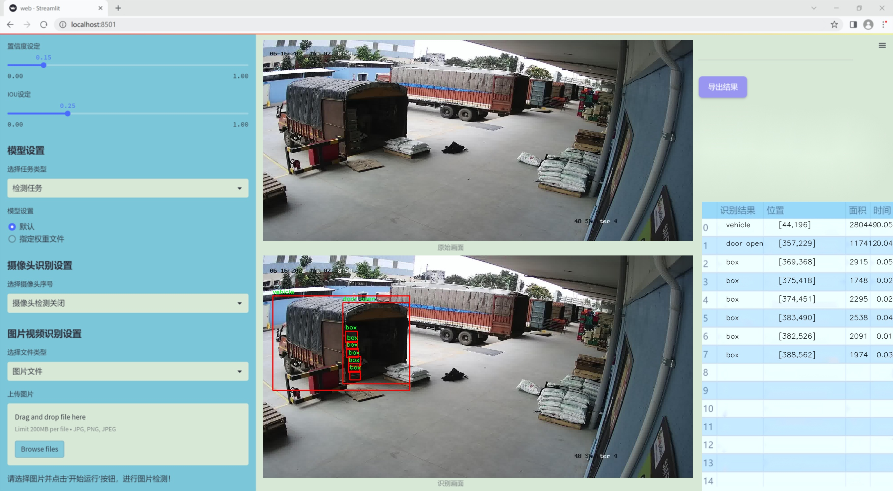
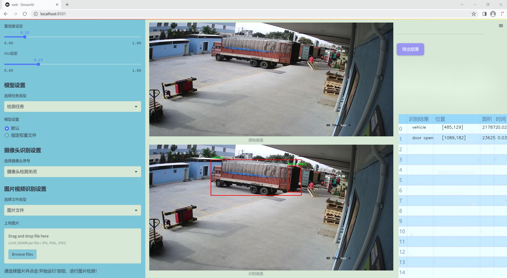
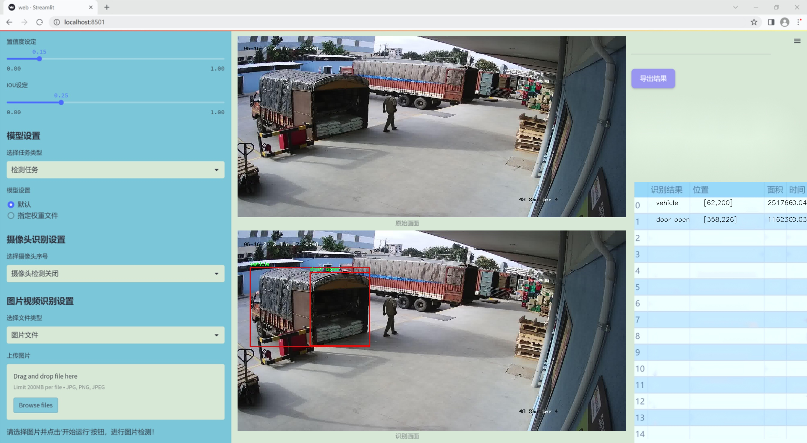
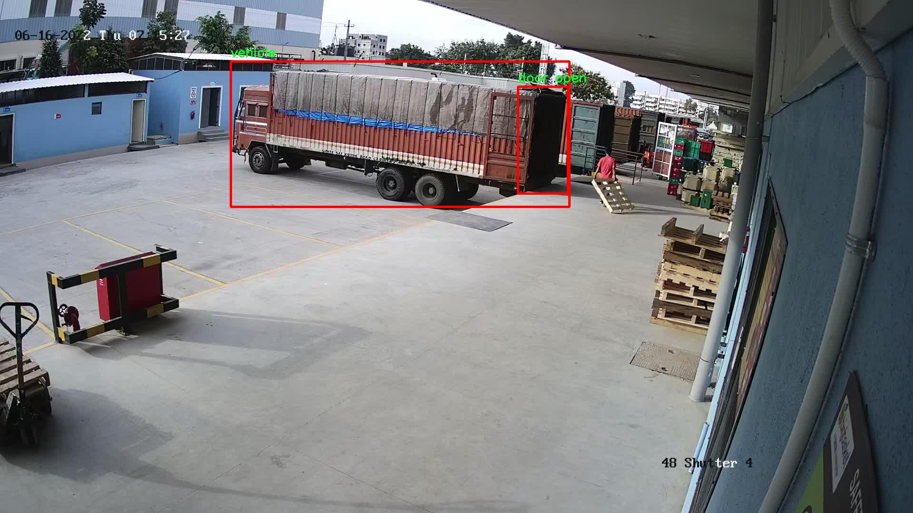
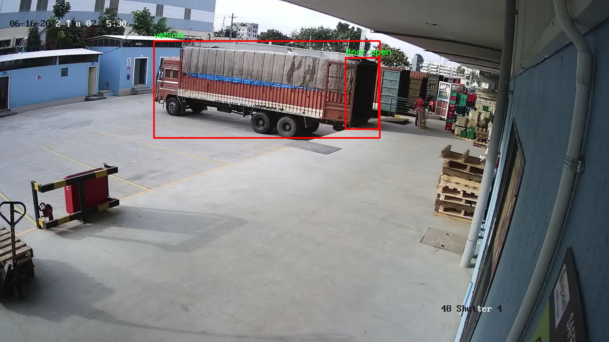

# 改进yolo11-RevCol等200+全套创新点大全：装卸区货车卸货检测系统源码＆数据集全套

### 1.图片效果展示







##### 项目来源 **[人工智能促进会 2024.10.22](https://kdocs.cn/l/cszuIiCKVNis)**

##### 注意：由于项目一直在更新迭代，上面“1.图片效果展示”和“2.视频效果展示”展示的系统图片或者视频可能为老版本，新版本在老版本的基础上升级如下：（实际效果以升级的新版本为准）

  （1）适配了YOLOV11的“目标检测”模型和“实例分割”模型，通过加载相应的权重（.pt）文件即可自适应加载模型。

  （2）支持“图片识别”、“视频识别”、“摄像头实时识别”三种识别模式。

  （3）支持“图片识别”、“视频识别”、“摄像头实时识别”三种识别结果保存导出，解决手动导出（容易卡顿出现爆内存）存在的问题，识别完自动保存结果并导出到tempDir中。

  （4）支持Web前端系统中的标题、背景图等自定义修改。

  另外本项目提供训练的数据集和训练教程,暂不提供权重文件（best.pt）,需要您按照教程进行训练后实现图片演示和Web前端界面演示的效果。

### 2.视频效果展示

[2.1 视频效果展示](https://www.bilibili.com/video/BV1s5yZYRErH/)

### 3.背景

研究背景与意义

随着全球贸易的不断发展，物流行业面临着日益增长的货物运输需求。在这一背景下，装卸区的高效管理显得尤为重要。装卸区是货物进出仓库的关键环节，如何快速、准确地检测和管理卸货过程中的货物类型，成为提升物流效率的关键因素之一。传统的人工检测方法不仅效率低下，而且容易出现人为错误，导致货物损失或延误。因此，开发一种基于计算机视觉的自动化检测系统显得尤为必要。

本研究旨在基于改进的YOLOv11模型，构建一个高效的装卸区货车卸货检测系统。YOLO（You Only Look Once）系列模型以其快速的检测速度和较高的准确率，广泛应用于实时目标检测任务。通过对YOLOv11的改进，我们希望能够进一步提升其在复杂环境下的检测性能，尤其是在装卸区这一动态且多变的场景中。

在数据集方面，本研究使用了包含856张图像的特定数据集，涵盖了多种货物类别，包括箱子、关闭的门、打开的门、袋子和车辆。这些类别的选择反映了装卸区中常见的物品和场景，能够为模型的训练提供丰富的样本。通过对这些数据的深入分析和处理，我们期望提高模型对不同货物的识别能力，从而实现对卸货过程的全面监控。

综上所述，基于改进YOLOv11的装卸区货车卸货检测系统不仅具有重要的理论研究价值，也具备广泛的实际应用前景。该系统的成功实施将为物流行业的智能化发展提供有力支持，推动物流管理的效率提升和成本降低。

### 4.数据集信息展示

##### 4.1 本项目数据集详细数据（类别数＆类别名）

nc: 5
names: ['box', 'door close', 'door open', 'sack', 'vehicle']


该项目为【目标检测】数据集，请在【训练教程和Web端加载模型教程（第三步）】这一步的时候按照【目标检测】部分的教程来训练

##### 4.2 本项目数据集信息介绍

本项目数据集信息介绍

本项目所使用的数据集名为“bb”，旨在为改进YOLOv11的装卸区货车卸货检测系统提供高质量的训练数据。该数据集包含五个类别，分别为“box”（箱子）、“door close”（门关闭）、“door open”（门打开）、“sack”（袋子）和“vehicle”（车辆）。这些类别的选择反映了装卸区货车卸货过程中可能出现的关键物体，能够有效支持模型在实际应用中的表现。

在数据集的构建过程中，我们特别注重数据的多样性和代表性，以确保模型能够在各种环境和条件下进行准确的物体检测。数据集中包含了不同类型和尺寸的箱子、袋子，以及不同状态的门（打开和关闭），这些样本不仅涵盖了不同的光照条件和视角，还考虑了各种背景干扰因素。这种多样性使得模型在面对实际操作时，能够更好地适应不同的场景，提高检测的准确性和鲁棒性。

此外，数据集中的车辆类别涵盖了多种类型的货车，确保模型能够识别并区分不同的运输工具。这对于提升装卸区的自动化水平和工作效率具有重要意义。通过对“bb”数据集的训练，YOLOv11模型将能够实现对卸货过程中的关键物体进行实时监测和识别，从而为后续的智能化管理提供有力支持。

总之，“bb”数据集不仅为本项目提供了丰富的训练素材，还为改进YOLOv11的装卸区货车卸货检测系统奠定了坚实的基础。通过对该数据集的深入分析和利用，我们期望能够显著提升模型的性能，为实际应用带来更高的效率和准确性。






### 5.全套项目环境部署视频教程（零基础手把手教学）

[5.1 所需软件PyCharm和Anaconda安装教程（第一步）](https://www.bilibili.com/video/BV1BoC1YCEKi/?spm_id_from=333.999.0.0&vd_source=bc9aec86d164b67a7004b996143742dc)


[5.2 安装Python虚拟环境创建和依赖库安装视频教程（第二步）](https://www.bilibili.com/video/BV1ZoC1YCEBw?spm_id_from=333.788.videopod.sections&vd_source=bc9aec86d164b67a7004b996143742dc)

### 6.改进YOLOv11训练教程和Web_UI前端加载模型教程（零基础手把手教学）

[6.1 改进YOLOv11训练教程和Web_UI前端加载模型教程（第三步）](https://www.bilibili.com/video/BV1BoC1YCEhR?spm_id_from=333.788.videopod.sections&vd_source=bc9aec86d164b67a7004b996143742dc)


按照上面的训练视频教程链接加载项目提供的数据集，运行train.py即可开始训练



     Epoch   gpu_mem       box       obj       cls    labels  img_size
     1/200     20.8G   0.01576   0.01955  0.007536        22      1280: 100%|██████████| 849/849 [14:42<00:00,  1.04s/it]
               Class     Images     Labels          P          R     mAP@.5 mAP@.5:.95: 100%|██████████| 213/213 [01:14<00:00,  2.87it/s]
                 all       3395      17314      0.994      0.957      0.0957      0.0843

     Epoch   gpu_mem       box       obj       cls    labels  img_size
     2/200     20.8G   0.01578   0.01923  0.007006        22      1280: 100%|██████████| 849/849 [14:44<00:00,  1.04s/it]
               Class     Images     Labels          P          R     mAP@.5 mAP@.5:.95: 100%|██████████| 213/213 [01:12<00:00,  2.95it/s]
                 all       3395      17314      0.996      0.956      0.0957      0.0845

     Epoch   gpu_mem       box       obj       cls    labels  img_size
     3/200     20.8G   0.01561    0.0191  0.006895        27      1280: 100%|██████████| 849/849 [10:56<00:00,  1.29it/s]
               Class     Images     Labels          P          R     mAP@.5 mAP@.5:.95: 100%|███████   | 187/213 [00:52<00:00,  4.04it/s]
                 all       3395      17314      0.996      0.957      0.0957      0.0845


###### [项目数据集下载链接](https://kdocs.cn/l/cszuIiCKVNis)

### 7.原始YOLOv11算法讲解

##### YOLO11简介

> YOLO11源码地址：https://github.com/ultralytics/ultralytics

Ultralytics
YOLO11是一款尖端的、最先进的模型，它在之前YOLO版本成功的基础上进行了构建，并引入了新功能和改进，以进一步提升性能和灵活性。YOLO11设计快速、准确且易于使用，使其成为各种物体检测和跟踪、实例分割、图像分类以及姿态估计任务的绝佳选择。  


**YOLO11创新点如下:**

YOLO 11主要改进包括：  
`增强的特征提取`：YOLO 11采用了改进的骨干和颈部架构，增强了特征提取功能，以实现更精确的目标检测。  
`优化的效率和速度`：优化的架构设计和优化的训练管道提供更快的处理速度，同时保持准确性和性能之间的平衡。  
`更高的精度，更少的参数`：YOLO11m在COCO数据集上实现了更高的平均精度（mAP），参数比YOLOv8m少22%，使其在不影响精度的情况下提高了计算效率。  
`跨环境的适应性`：YOLO 11可以部署在各种环境中，包括边缘设备、云平台和支持NVIDIA GPU的系统。  
`广泛的支持任务`：YOLO 11支持各种计算机视觉任务，如对象检测、实例分割、图像分类、姿态估计和面向对象检测（OBB）。

**YOLO11不同模型尺寸信息：**

YOLO11 提供5种不同的型号规模模型，以满足不同的应用需求：

Model| size (pixels)| mAPval 50-95| Speed CPU ONNX (ms)| Speed T4 TensorRT10
(ms)| params (M)| FLOPs (B)  
---|---|---|---|---|---|---  
YOLO11n| 640| 39.5| 56.1 ± 0.8| 1.5 ± 0.0| 2.6| 6.5  
YOLO11s| 640| 47.0| 90.0 ± 1.2| 2.5 ± 0.0| 9.4| 21.5  
YOLO11m| 640| 51.5| 183.2 ± 2.0| 4.7 ± 0.1| 20.1| 68.0  
YOLO11l| 640| 53.4| 238.6 ± 1.4| 6.2 ± 0.1| 25.3| 86.9  
YOLO11x| 640| 54.7| 462.8 ± 6.7| 11.3 ± 0.2| 56.9| 194.9  
  
**模型常用训练超参数参数说明：**  
`YOLOv11
模型的训练设置包括训练过程中使用的各种超参数和配置`。这些设置会影响模型的性能、速度和准确性。关键的训练设置包括批量大小、学习率、动量和权重衰减。此外，优化器、损失函数和训练数据集组成的选择也会影响训练过程。对这些设置进行仔细的调整和实验对于优化性能至关重要。  
**以下是一些常用的模型训练参数和说明：**

参数名| 默认值| 说明  
---|---|---  
`model`| `None`| 指定用于训练的模型文件。接受指向 `.pt` 预训练模型或 `.yaml`
配置文件。对于定义模型结构或初始化权重至关重要。  
`data`| `None`| 数据集配置文件的路径（例如
`coco8.yaml`).该文件包含特定于数据集的参数，包括训练数据和验证数据的路径、类名和类数。  
`epochs`| `100`| 训练总轮数。每个epoch代表对整个数据集进行一次完整的训练。调整该值会影响训练时间和模型性能。  
`patience`| `100`| 在验证指标没有改善的情况下，提前停止训练所需的epoch数。当性能趋于平稳时停止训练，有助于防止过度拟合。  
`batch`| `16`| 批量大小，有三种模式:设置为整数(例如，’ Batch =16 ‘)， 60% GPU内存利用率的自动模式(’ Batch
=-1 ‘)，或指定利用率分数的自动模式(’ Batch =0.70 ')。  
`imgsz`| `640`| 用于训练的目标图像尺寸。所有图像在输入模型前都会被调整到这一尺寸。影响模型精度和计算复杂度。  
`device`| `None`| 指定用于训练的计算设备：单个 GPU (`device=0`）、多个 GPU (`device=0,1`)、CPU
(`device=cpu`)，或苹果芯片的 MPS (`device=mps`).  
`workers`| `8`| 加载数据的工作线程数（每 `RANK` 多 GPU 训练）。影响数据预处理和输入模型的速度，尤其适用于多 GPU 设置。  
`name`| `None`| 训练运行的名称。用于在项目文件夹内创建一个子目录，用于存储训练日志和输出结果。  
`pretrained`| `True`| 决定是否从预处理模型开始训练。可以是布尔值，也可以是加载权重的特定模型的字符串路径。提高训练效率和模型性能。  
`optimizer`| `'auto'`| 为训练模型选择优化器。选项包括 `SGD`, `Adam`, `AdamW`, `NAdam`,
`RAdam`, `RMSProp` 等，或 `auto` 用于根据模型配置进行自动选择。影响收敛速度和稳定性  
`lr0`| `0.01`| 初始学习率（即 `SGD=1E-2`, `Adam=1E-3`) .调整这个值对优化过程至关重要，会影响模型权重的更新速度。  
`lrf`| `0.01`| 最终学习率占初始学习率的百分比 = (`lr0 * lrf`)，与调度程序结合使用，随着时间的推移调整学习率。  


**各损失函数作用说明：**  
`定位损失box_loss`：预测框与标定框之间的误差（GIoU），越小定位得越准；  
`分类损失cls_loss`：计算锚框与对应的标定分类是否正确，越小分类得越准；  
`动态特征损失（dfl_loss）`：DFLLoss是一种用于回归预测框与目标框之间距离的损失函数。在计算损失时，目标框需要缩放到特征图尺度，即除以相应的stride，并与预测的边界框计算Ciou
Loss，同时与预测的anchors中心点到各边的距离计算回归DFLLoss。  


### 8.200+种全套改进YOLOV11创新点原理讲解

#### 8.1 200+种全套改进YOLOV11创新点原理讲解大全

由于篇幅限制，每个创新点的具体原理讲解就不全部展开，具体见下列网址中的改进模块对应项目的技术原理博客网址【Blog】（创新点均为模块化搭建，原理适配YOLOv5~YOLOv11等各种版本）

[改进模块技术原理博客【Blog】网址链接](https://gitee.com/qunmasj/good)


#### 8.2 精选部分改进YOLOV11创新点原理讲解

###### 这里节选部分改进创新点展开原理讲解(完整的改进原理见上图和[改进模块技术原理博客链接](https://gitee.com/qunmasj/good)【如果此小节的图加载失败可以通过CSDN或者Github搜索该博客的标题访问原始博客，原始博客图片显示正常】

### RCS-OSA的基本原理
参考该博客，RCSOSA（RCS-One-Shot Aggregation）是RCS-YOLO中提出的一种结构，我们可以将主要原理概括如下：

1. RCS（Reparameterized Convolution based on channel Shuffle）: 结合了通道混洗，通过重参数化卷积来增强网络的特征提取能力。

2. RCS模块: 在训练阶段，利用多分支结构学习丰富的特征表示；在推理阶段，通过结构化重参数化简化为单一分支，减少内存消耗。

3. OSA（One-Shot Aggregation）: 一次性聚合多个特征级联，减少网络计算负担，提高计算效率。

4. 特征级联: RCS-OSA模块通过堆叠RCS，确保特征的复用并加强不同层之间的信息流动。

#### RCS
RCS（基于通道Shuffle的重参数化卷积）是RCS-YOLO的核心组成部分，旨在训练阶段通过多分支结构学习丰富的特征信息，并在推理阶段通过简化为单分支结构来减少内存消耗，实现快速推理。此外，RCS利用通道分割和通道Shuffle操作来降低计算复杂性，同时保持通道间的信息交换，这样在推理阶段相比普通的3×3卷积可以减少一半的计算复杂度。通过结构重参数化，RCS能够在训练阶段从输入特征中学习深层表示，并在推理阶段实现快速推理，同时减少内存消耗。

#### RCS模块
RCS（基于通道Shuffle的重参数化卷积）模块中，结构在训练阶段使用多个分支，包括1x1和3x3的卷积，以及一个直接的连接（Identity），用于学习丰富的特征表示。在推理阶段，结构被重参数化成一个单一的3x3卷积，以减少计算复杂性和内存消耗，同时保持训练阶段学到的特征表达能力。这与RCS的设计理念紧密相连，即在不牺牲性能的情况下提高计算效率。


上图为大家展示了RCS的结构，分为训练阶段（a部分）和推理阶段（b部分）。在训练阶段，输入通过通道分割，一部分输入经过RepVGG块，另一部分保持不变。然后通过1x1卷积和3x3卷积处理RepVGG块的输出，与另一部分输入进行通道Shuffle和连接。在推理阶段，原来的多分支结构被简化为一个单一的3x3 RepConv块。这种设计允许在训练时学习复杂特征，在推理时减少计算复杂度。黑色边框的矩形代表特定的模块操作，渐变色的矩形代表张量的特定特征，矩形的宽度代表张量的通道数。 

#### OSA
OSA（One-Shot Aggregation）是一个关键的模块，旨在提高网络在处理密集连接时的效率。OSA模块通过表示具有多个感受野的多样化特征，并在最后的特征映射中仅聚合一次所有特征，从而克服了DenseNet中密集连接的低效率问题。

OSA模块的使用有两个主要目的：

1. 提高特征表示的多样性：OSA通过聚合具有不同感受野的特征来增加网络对于不同尺度的敏感性，这有助于提升模型对不同大小目标的检测能力。

2. 提高效率：通过在网络的最后一部分只进行一次特征聚合，OSA减少了重复的特征计算和存储需求，从而提高了网络的计算和能源效率。

在RCS-YOLO中，OSA模块被进一步与RCS（基于通道Shuffle的重参数化卷积）相结合，形成RCS-OSA模块。这种结合不仅保持了低成本的内存消耗，而且还实现了语义信息的有效提取，对于构建轻量级和大规模的对象检测器尤为重要。

下面我将为大家展示RCS-OSA（One-Shot Aggregation of RCS）的结构。


在RCS-OSA模块中，输入被分为两部分，一部分直接通过，另一部分通过堆叠的RCS模块进行处理。处理后的特征和直接通过的特征在通道混洗（Channel Shuffle）后合并。这种结构设计用于增强模型的特征提取和利用效率，是RCS-YOLO架构中的一个关键组成部分旨在通过一次性聚合来提高模型处理特征的能力，同时保持计算效率。

#### 特征级联
特征级联（feature cascade）是一种技术，通过在网络的一次性聚合（one-shot aggregate）路径上维持有限数量的特征级联来实现的。在RCS-YOLO中，特别是在RCS-OSA（RCS-Based One-Shot Aggregation）模块中，只保留了三个特征级联。

特征级联的目的是为了减轻网络计算负担并降低内存占用。这种方法可以有效地聚合不同层次的特征，提高模型的语义信息提取能力，同时避免了过度复杂化网络结构所带来的低效率和高资源消耗。

下面为大家提供的图像展示的是RCS-YOLO的整体架构，其中包括RCS-OSA模块。RCS-OSA在模型中用于堆叠RCS模块，以确保特征的复用并加强不同层之间的信息流动。图中显示的多层RCS-OSA模块的排列和组合反映了它们如何一起工作以优化特征传递和提高检测性能。


总结：RCS-YOLO主要由RCS-OSA（蓝色模块）和RepVGG（橙色模块）构成。这里的n代表堆叠RCS模块的数量。n_cls代表检测到的对象中的类别数量。图中的IDetect是从YOLOv11中借鉴过来的，表示使用二维卷积神经网络的检测层。这个架构通过堆叠的RCS模块和RepVGG模块，以及两种类型的检测层，实现了对象检测的任务。 


### 9.系统功能展示

图9.1.系统支持检测结果表格显示

  图9.2.系统支持置信度和IOU阈值手动调节

  图9.3.系统支持自定义加载权重文件best.pt(需要你通过步骤5中训练获得)

  图9.4.系统支持摄像头实时识别

  图9.5.系统支持图片识别

  图9.6.系统支持视频识别

  图9.7.系统支持识别结果文件自动保存

  图9.8.系统支持Excel导出检测结果数据


### 10. YOLOv11核心改进源码讲解

#### 10.1 test_selective_scan_speed.py

以下是对您提供的代码进行的核心部分提取和详细中文注释。代码主要实现了选择性扫描（Selective Scan）功能，通常用于处理序列数据的动态计算。

```python
import torch
import torch.nn.functional as F
from einops import rearrange

def build_selective_scan_fn(selective_scan_cuda: object = None, mode="mamba_ssm", tag=None):
    """
    构建选择性扫描函数的工厂方法。
    
    参数:
    selective_scan_cuda: 用于CUDA实现的选择性扫描模块
    mode: 选择性扫描的模式
    tag: 可选的标签，用于标识
    
    返回:
    selective_scan_fn: 选择性扫描函数
    """
    
    class SelectiveScanFn(torch.autograd.Function):
        @staticmethod
        def forward(ctx, u, delta, A, B, C, D=None, z=None, delta_bias=None, delta_softplus=False, return_last_state=False, nrows=1, backnrows=-1):
            """
            前向传播方法，计算选择性扫描的输出。
            
            参数:
            ctx: 上下文对象，用于保存状态
            u: 输入张量
            delta: 变化率张量
            A, B, C: 权重张量
            D: 可选的偏置张量
            z: 可选的门控张量
            delta_bias: 可选的偏置变化率
            delta_softplus: 是否使用softplus激活
            return_last_state: 是否返回最后状态
            nrows: 行数
            backnrows: 反向传播时的行数
            
            返回:
            out: 输出张量
            last_state: 最后状态（可选）
            """
            # 确保输入张量是连续的
            if u.stride(-1) != 1:
                u = u.contiguous()
            if delta.stride(-1) != 1:
                delta = delta.contiguous()
            if D is not None:
                D = D.contiguous()
            if B.stride(-1) != 1:
                B = B.contiguous()
            if C.stride(-1) != 1:
                C = C.contiguous()
            if z is not None and z.stride(-1) != 1:
                z = z.contiguous()

            # 处理B和C的维度
            if B.dim() == 3:
                B = rearrange(B, "b dstate l -> b 1 dstate l")
                ctx.squeeze_B = True
            if C.dim() == 3:
                C = rearrange(C, "b dstate l -> b 1 dstate l")
                ctx.squeeze_C = True

            # 检查输入的形状是否符合要求
            assert u.shape[1] % (B.shape[1] * nrows) == 0 
            assert nrows in [1, 2, 3, 4]  # 限制行数

            # 选择CUDA实现进行前向计算
            if mode == "mamba_ssm":
                out, x, *rest = selective_scan_cuda.fwd(u, delta, A, B, C, D, z, delta_bias, delta_softplus)
            else:
                raise NotImplementedError("未实现的模式")

            # 保存上下文信息
            ctx.delta_softplus = delta_softplus
            ctx.has_z = z is not None
            last_state = x[:, :, -1, 1::2]  # 获取最后状态

            # 保存用于反向传播的张量
            ctx.save_for_backward(u, delta, A, B, C, D, delta_bias, x)
            return out if not return_last_state else (out, last_state)

        @staticmethod
        def backward(ctx, dout):
            """
            反向传播方法，计算梯度。
            
            参数:
            ctx: 上下文对象
            dout: 输出的梯度
            
            返回:
            du, ddelta, dA, dB, dC, dD, dz, ddelta_bias: 各个输入的梯度
            """
            u, delta, A, B, C, D, delta_bias, x = ctx.saved_tensors
            
            # 选择CUDA实现进行反向计算
            du, ddelta, dA, dB, dC, dD, ddelta_bias, *rest = selective_scan_cuda.bwd(
                u, delta, A, B, C, D, delta_bias, dout, x, ctx.delta_softplus
            )

            return (du, ddelta, dA, dB, dC, dD if D is not None else None, None, ddelta_bias if delta_bias is not None else None)

    # 返回选择性扫描函数
    return SelectiveScanFn.apply

def selective_scan_ref(u, delta, A, B, C, D=None, z=None, delta_bias=None, delta_softplus=False, return_last_state=False):
    """
    参考实现的选择性扫描函数。
    
    参数:
    u, delta, A, B, C, D, z, delta_bias, delta_softplus, return_last_state: 输入参数
    
    返回:
    out: 输出张量
    last_state: 最后状态（可选）
    """
    # 将输入转换为浮点数
    u = u.float()
    delta = delta.float()
    if delta_bias is not None:
        delta = delta + delta_bias[..., None].float()
    if delta_softplus:
        delta = F.softplus(delta)

    # 初始化状态
    batch, dim, dstate = u.shape[0], A.shape[0], A.shape[1]
    x = A.new_zeros((batch, dim, dstate))
    ys = []

    # 计算状态更新
    for i in range(u.shape[2]):
        x = delta[:, :, i] * x + B[:, :, i] * u[:, :, i]
        y = torch.einsum('bdn,dn->bd', x, C)
        ys.append(y)

    # 堆叠输出
    out = torch.stack(ys, dim=2)  # (batch dim L)
    return out if not return_last_state else (out, x)

# 其他辅助函数可以根据需要进行简化或保留
```

### 代码说明：
1. **`build_selective_scan_fn`**: 该函数构建了一个选择性扫描的自定义PyTorch函数，支持前向和反向传播。它根据给定的模式选择不同的CUDA实现。
2. **`SelectiveScanFn`**: 这是一个继承自`torch.autograd.Function`的类，定义了前向和反向传播的具体实现。
3. **`forward`**: 前向传播方法，计算选择性扫描的输出，并保存必要的张量以供反向传播使用。
4. **`backward`**: 反向传播方法，计算输入张量的梯度。
5. **`selective_scan_ref`**: 参考实现的选择性扫描函数，提供了一个简单的实现，便于理解选择性扫描的基本逻辑。

以上是对代码的核心部分提取和详细注释，希望能帮助您理解选择性扫描的实现逻辑。

这个文件 `test_selective_scan_speed.py` 是一个用于测试选择性扫描（Selective Scan）速度的程序，主要依赖于 PyTorch 库。文件中定义了一些函数和类，旨在实现选择性扫描的前向和反向传播，并进行性能测试。

首先，文件导入了必要的库，包括 `torch` 和 `pytest`，以及一些数学和时间处理的模块。接着，定义了一个构建选择性扫描函数的工厂函数 `build_selective_scan_fn`，该函数接收一个 CUDA 实现的选择性扫描函数和一些其他参数。它返回一个自定义的 PyTorch 函数 `selective_scan_fn`，该函数使用 PyTorch 的自动求导功能。

在 `SelectiveScanFn` 类中，定义了前向传播和反向传播的静态方法。前向传播方法 `forward` 接收多个输入，包括状态变量 `u`、增量 `delta`、以及其他矩阵 `A`、`B`、`C` 和可选的 `D`、`z` 等。该方法首先确保输入张量是连续的，然后根据输入的维度和模式对输入进行调整。接着，它调用不同模式下的 CUDA 实现进行前向计算，并保存必要的中间结果以便后续的反向传播。

反向传播方法 `backward` 则根据保存的上下文计算梯度，支持不同的模式，并返回相应的梯度信息。

文件中还定义了多个选择性扫描的参考实现函数，例如 `selective_scan_ref` 和 `selective_scan_easy`，这些函数实现了选择性扫描的基本逻辑，主要通过张量运算来实现。

在 `test_speed` 函数中，设置了一些测试参数，包括模式、数据类型、序列长度、批量大小等。然后生成随机输入数据，并通过不同的选择性扫描实现进行多次前向和反向传播测试，以测量其性能。每个测试的执行时间被记录并打印出来，以便进行比较。

总的来说，这个文件的主要目的是实现选择性扫描的高效计算，并通过性能测试来评估不同实现的速度。它展示了如何利用 PyTorch 的自定义函数和 CUDA 加速来优化深度学习中的某些计算。

#### 10.2 predict.py

以下是代码中最核心的部分，并附上详细的中文注释：

```python
from ultralytics.engine.predictor import BasePredictor
from ultralytics.engine.results import Results
from ultralytics.utils import ops

class DetectionPredictor(BasePredictor):
    """
    DetectionPredictor类，继承自BasePredictor类，用于基于检测模型进行预测。
    """

    def postprocess(self, preds, img, orig_imgs):
        """后处理预测结果，并返回Results对象的列表。"""
        
        # 使用非极大值抑制（NMS）来过滤预测框
        preds = ops.non_max_suppression(
            preds,  # 预测框
            self.args.conf,  # 置信度阈值
            self.args.iou,  # IOU阈值
            agnostic=self.args.agnostic_nms,  # 是否进行类别无关的NMS
            max_det=self.args.max_det,  # 最大检测框数量
            classes=self.args.classes,  # 过滤的类别
        )

        # 如果输入的原始图像不是列表，则将其转换为numpy数组
        if not isinstance(orig_imgs, list):  # 输入图像是torch.Tensor而不是列表
            orig_imgs = ops.convert_torch2numpy_batch(orig_imgs)  # 转换为numpy数组

        results = []  # 存储结果的列表
        for i, pred in enumerate(preds):  # 遍历每个预测框
            orig_img = orig_imgs[i]  # 获取对应的原始图像
            # 将预测框的坐标缩放到原始图像的尺寸
            pred[:, :4] = ops.scale_boxes(img.shape[2:], pred[:, :4], orig_img.shape)
            img_path = self.batch[0][i]  # 获取图像路径
            # 创建Results对象并添加到结果列表中
            results.append(Results(orig_img, path=img_path, names=self.model.names, boxes=pred))
        
        return results  # 返回处理后的结果列表
```

### 代码说明：
1. **类定义**：`DetectionPredictor`类用于处理检测模型的预测，继承自`BasePredictor`。
2. **后处理方法**：`postprocess`方法负责对模型的预测结果进行后处理，主要步骤包括：
   - 使用非极大值抑制（NMS）来去除重叠的预测框。
   - 将输入的原始图像转换为numpy数组（如果不是列表的话）。
   - 遍历每个预测框，缩放其坐标以适应原始图像的尺寸，并创建`Results`对象来存储最终的预测结果。

这个程序文件 `predict.py` 是一个用于目标检测的预测类，继承自 `BasePredictor` 类，属于 Ultralytics YOLO 项目的一部分。该类的主要功能是对输入的图像进行目标检测，并返回处理后的结果。

在类的文档字符串中，提供了一个使用示例，展示了如何导入必要的模块，创建 `DetectionPredictor` 的实例，并调用 `predict_cli` 方法进行预测。这个示例中，`model` 参数指定了使用的 YOLO 模型文件（如 `yolov8n.pt`），而 `source` 参数则指向输入数据的来源。

类中定义了一个 `postprocess` 方法，该方法负责对模型的预测结果进行后处理。具体来说，首先调用 `ops.non_max_suppression` 函数对预测结果进行非极大值抑制，以过滤掉重叠的框并保留置信度较高的检测结果。该函数的参数包括置信度阈值、IOU 阈值、是否使用类别无关的 NMS、最大检测数量以及要检测的类别。

接下来，方法检查输入的原始图像是否为列表形式。如果不是，则将其转换为 NumPy 数组。然后，方法会遍历每个预测结果，使用 `ops.scale_boxes` 函数将预测框的坐标缩放到原始图像的尺寸。每个处理后的结果都被封装在 `Results` 对象中，并包含原始图像、图像路径、模型名称和检测框信息。

最后，所有的结果对象被收集到一个列表中并返回。这使得调用该方法的代码能够轻松地获取和使用目标检测的结果。整体上，这个文件提供了一个清晰的接口，用于在目标检测任务中进行图像预测和结果处理。

#### 10.3 VanillaNet.py

以下是简化后的核心代码，并附上详细的中文注释：

```python
import torch
import torch.nn as nn
import torch.nn.functional as F
from timm.layers import weight_init

# 定义激活函数类
class Activation(nn.ReLU):
    def __init__(self, dim, act_num=3, deploy=False):
        super(Activation, self).__init__()
        self.deploy = deploy
        # 初始化权重
        self.weight = torch.nn.Parameter(torch.randn(dim, 1, act_num*2 + 1, act_num*2 + 1))
        self.bias = None
        self.bn = nn.BatchNorm2d(dim, eps=1e-6)  # 批归一化
        self.dim = dim
        self.act_num = act_num
        weight_init.trunc_normal_(self.weight, std=.02)  # 权重初始化

    def forward(self, x):
        # 前向传播
        if self.deploy:
            return F.conv2d(
                super(Activation, self).forward(x), 
                self.weight, self.bias, padding=(self.act_num*2 + 1)//2, groups=self.dim)
        else:
            return self.bn(F.conv2d(
                super(Activation, self).forward(x),
                self.weight, padding=self.act_num, groups=self.dim))

    def switch_to_deploy(self):
        # 切换到部署模式，融合批归一化
        if not self.deploy:
            kernel, bias = self._fuse_bn_tensor(self.weight, self.bn)
            self.weight.data = kernel
            self.bias = torch.nn.Parameter(torch.zeros(self.dim))
            self.bias.data = bias
            self.__delattr__('bn')  # 删除bn属性
            self.deploy = True

    def _fuse_bn_tensor(self, weight, bn):
        # 融合批归一化的权重和偏置
        kernel = weight
        running_mean = bn.running_mean
        running_var = bn.running_var
        gamma = bn.weight
        beta = bn.bias
        eps = bn.eps
        std = (running_var + eps).sqrt()
        t = (gamma / std).reshape(-1, 1, 1, 1)
        return kernel * t, beta + (0 - running_mean) * gamma / std

# 定义基本模块Block
class Block(nn.Module):
    def __init__(self, dim, dim_out, act_num=3, stride=2, deploy=False):
        super().__init__()
        self.deploy = deploy
        if self.deploy:
            self.conv = nn.Conv2d(dim, dim_out, kernel_size=1)
        else:
            self.conv1 = nn.Sequential(
                nn.Conv2d(dim, dim, kernel_size=1),
                nn.BatchNorm2d(dim, eps=1e-6),
            )
            self.conv2 = nn.Sequential(
                nn.Conv2d(dim, dim_out, kernel_size=1),
                nn.BatchNorm2d(dim_out, eps=1e-6)
            )
        self.pool = nn.MaxPool2d(stride) if stride != 1 else nn.Identity()  # 池化层
        self.act = Activation(dim_out, act_num)  # 激活函数

    def forward(self, x):
        # 前向传播
        if self.deploy:
            x = self.conv(x)
        else:
            x = self.conv1(x)
            x = F.leaky_relu(x, negative_slope=1)  # 使用Leaky ReLU激活
            x = self.conv2(x)

        x = self.pool(x)  # 池化
        x = self.act(x)  # 激活
        return x

    def switch_to_deploy(self):
        # 切换到部署模式
        if not self.deploy:
            kernel, bias = self._fuse_bn_tensor(self.conv1[0], self.conv1[1])
            self.conv1[0].weight.data = kernel
            self.conv1[0].bias.data = bias
            kernel, bias = self._fuse_bn_tensor(self.conv2[0], self.conv2[1])
            self.conv = self.conv2[0]
            self.conv.weight.data = kernel
            self.conv.bias.data = bias
            self.__delattr__('conv1')
            self.__delattr__('conv2')
            self.act.switch_to_deploy()
            self.deploy = True

# 定义主网络结构VanillaNet
class VanillaNet(nn.Module):
    def __init__(self, in_chans=3, num_classes=1000, dims=[96, 192, 384, 768], strides=[2,2,2,1], deploy=False):
        super().__init__()
        self.deploy = deploy
        if self.deploy:
            self.stem = nn.Sequential(
                nn.Conv2d(in_chans, dims[0], kernel_size=4, stride=4),
                Activation(dims[0])
            )
        else:
            self.stem1 = nn.Sequential(
                nn.Conv2d(in_chans, dims[0], kernel_size=4, stride=4),
                nn.BatchNorm2d(dims[0], eps=1e-6),
            )
            self.stem2 = nn.Sequential(
                nn.Conv2d(dims[0], dims[0], kernel_size=1, stride=1),
                nn.BatchNorm2d(dims[0], eps=1e-6),
                Activation(dims[0])
            )

        self.stages = nn.ModuleList()
        for i in range(len(strides)):
            stage = Block(dim=dims[i], dim_out=dims[i+1], stride=strides[i], deploy=deploy)
            self.stages.append(stage)

    def forward(self, x):
        # 前向传播
        if self.deploy:
            x = self.stem(x)
        else:
            x = self.stem1(x)
            x = F.leaky_relu(x, negative_slope=1)
            x = self.stem2(x)

        for stage in self.stages:
            x = stage(x)  # 逐层通过Block
        return x

    def switch_to_deploy(self):
        # 切换到部署模式
        if not self.deploy:
            self.stem2[2].switch_to_deploy()
            kernel, bias = self._fuse_bn_tensor(self.stem1[0], self.stem1[1])
            self.stem1[0].weight.data = kernel
            self.stem1[0].bias.data = bias
            self.stem = nn.Sequential(self.stem1[0], self.stem2[2])
            self.__delattr__('stem1')
            self.__delattr__('stem2')

            for stage in self.stages:
                stage.switch_to_deploy()

            self.deploy = True

# 示例：创建模型并进行前向传播
if __name__ == '__main__':
    inputs = torch.randn((1, 3, 640, 640))  # 输入张量
    model = VanillaNet(dims=[128*4, 256*4, 512*4, 1024*4])  # 创建模型
    pred = model(inputs)  # 前向传播
    print(pred.size())  # 输出预测结果的尺寸
```

### 代码注释说明：
1. **Activation类**：定义了一个自定义的激活函数类，包含了权重初始化、前向传播和批归一化的融合。
2. **Block类**：定义了网络的基本模块，包含卷积层、池化层和激活函数，支持部署模式。
3. **VanillaNet类**：定义了整个网络结构，包含输入层、多个Block模块和前向传播逻辑。
4. **switch_to_deploy方法**：用于将模型切换到部署模式，融合批归一化层以提高推理效率。
5. **示例代码**：展示了如何创建模型并进行前向传播。

这个程序文件 `VanillaNet.py` 实现了一个名为 VanillaNet 的深度学习模型，主要用于图像处理任务。代码中包含了模型的定义、各个组件的实现，以及一些辅助函数和预训练模型的加载功能。

首先，文件中引入了必要的库，包括 PyTorch 和一些自定义的层和函数。接着，定义了一个 `activation` 类，该类继承自 `nn.ReLU`，用于实现一种可学习的激活函数。该类在初始化时会创建一个权重参数，并使用批归一化（Batch Normalization）来规范化输出。在前向传播中，根据是否处于部署模式（deploy），它会选择不同的计算方式。

接下来，定义了一个 `Block` 类，它是 VanillaNet 的基本构建块。每个 Block 包含多个卷积层和激活函数，并根据步幅（stride）选择池化操作。Block 类也实现了融合批归一化的功能，以便在模型部署时提高推理效率。

然后，`VanillaNet` 类是整个模型的核心。它包含了多个 Block，并在输入通道和输出类别数等参数上进行了配置。模型的构造函数会根据传入的参数初始化各个层，并定义前向传播过程。在前向传播中，模型会根据输入的大小提取特征，并在不同的尺度上返回特征图。

此外，文件中还定义了一些函数用于创建不同配置的 VanillaNet 模型（如 `vanillanet_5`, `vanillanet_6` 等），这些函数可以根据需要加载预训练权重。

最后，程序的主入口部分提供了一个示例，展示了如何创建一个 VanillaNet 模型并进行前向推理。通过随机生成的输入张量，模型会输出特征图的尺寸。

整体来看，这个文件实现了一个灵活且高效的卷积神经网络架构，适用于各种图像处理任务，并提供了便于使用的接口来加载预训练模型和进行推理。

#### 10.4 CSwomTramsformer.py

以下是经过简化和注释的核心代码部分，保留了CSWin Transformer的主要结构和功能：

```python
import torch
import torch.nn as nn
import numpy as np

class Mlp(nn.Module):
    """多层感知机（MLP）模块"""
    def __init__(self, in_features, hidden_features=None, out_features=None, act_layer=nn.GELU, drop=0.):
        super().__init__()
        out_features = out_features or in_features  # 输出特征数
        hidden_features = hidden_features or in_features  # 隐藏层特征数
        self.fc1 = nn.Linear(in_features, hidden_features)  # 第一层线性变换
        self.act = act_layer()  # 激活函数
        self.fc2 = nn.Linear(hidden_features, out_features)  # 第二层线性变换
        self.drop = nn.Dropout(drop)  # Dropout层

    def forward(self, x):
        """前向传播"""
        x = self.fc1(x)
        x = self.act(x)
        x = self.drop(x)
        x = self.fc2(x)
        x = self.drop(x)
        return x

class LePEAttention(nn.Module):
    """局部增强注意力（LePE）模块"""
    def __init__(self, dim, resolution, num_heads, split_size=7, attn_drop=0.):
        super().__init__()
        self.dim = dim  # 输入特征维度
        self.resolution = resolution  # 输入分辨率
        self.split_size = split_size  # 分割大小
        self.num_heads = num_heads  # 注意力头数
        head_dim = dim // num_heads  # 每个头的维度
        self.scale = head_dim ** -0.5  # 缩放因子
        self.get_v = nn.Conv2d(dim, dim, kernel_size=3, stride=1, padding=1, groups=dim)  # 卷积层用于获取v

    def im2cswin(self, x):
        """将输入转换为窗口格式"""
        B, N, C = x.shape
        H = W = int(np.sqrt(N))  # 计算高度和宽度
        x = x.transpose(-2, -1).contiguous().view(B, C, H, W)  # 转换形状
        # 将图像划分为窗口
        x = img2windows(x, self.split_size, self.split_size)
        return x

    def forward(self, qkv):
        """前向传播"""
        q, k, v = qkv  # 分别获取q, k, v
        q = self.im2cswin(q)  # 将q转换为窗口格式
        k = self.im2cswin(k)  # 将k转换为窗口格式
        v = self.get_v(v)  # 获取v
        q = q * self.scale  # 缩放q
        attn = (q @ k.transpose(-2, -1))  # 计算注意力
        attn = nn.functional.softmax(attn, dim=-1)  # softmax归一化
        x = attn @ v  # 计算输出
        return x

class CSWinBlock(nn.Module):
    """CSWin Transformer的基本块"""
    def __init__(self, dim, num_heads, split_size=7):
        super().__init__()
        self.dim = dim  # 输入特征维度
        self.num_heads = num_heads  # 注意力头数
        self.qkv = nn.Linear(dim, dim * 3)  # 线性层用于生成q, k, v
        self.attn = LePEAttention(dim, resolution=split_size, num_heads=num_heads)  # 注意力模块
        self.mlp = Mlp(in_features=dim, hidden_features=dim * 4)  # MLP模块

    def forward(self, x):
        """前向传播"""
        qkv = self.qkv(x).reshape(x.shape[0], -1, 3, self.dim).permute(2, 0, 1, 3)  # 生成q, k, v
        x = self.attn(qkv)  # 计算注意力
        x = x + self.mlp(x)  # 加上MLP的输出
        return x

class CSWinTransformer(nn.Module):
    """CSWin Transformer模型"""
    def __init__(self, img_size=640, num_classes=1000, embed_dim=96, depth=[2, 2, 6, 2], num_heads=12):
        super().__init__()
        self.num_classes = num_classes
        self.embed_dim = embed_dim  # 嵌入维度
        self.stage1 = nn.ModuleList([CSWinBlock(embed_dim, num_heads) for _ in range(depth[0])])  # 第一阶段
        self.stage2 = nn.ModuleList([CSWinBlock(embed_dim * 2, num_heads) for _ in range(depth[1])])  # 第二阶段
        # 其他阶段...

    def forward(self, x):
        """前向传播"""
        for blk in self.stage1:
            x = blk(x)  # 通过每个块
        for blk in self.stage2:
            x = blk(x)  # 通过每个块
        return x

# 示例用法
if __name__ == '__main__':
    inputs = torch.randn((1, 3, 640, 640))  # 输入数据
    model = CSWinTransformer()  # 创建模型
    res = model(inputs)  # 前向传播
    print(res.size())  # 输出结果的尺寸
```

### 代码说明：
1. **Mlp类**：实现了一个简单的多层感知机，包括两层线性变换和激活函数。
2. **LePEAttention类**：实现了局部增强注意力机制，负责将输入转换为窗口格式并计算注意力。
3. **CSWinBlock类**：定义了CSWin Transformer的基本块，包含注意力机制和MLP。
4. **CSWinTransformer类**：构建了整个CSWin Transformer模型，包含多个阶段的块。
5. **示例用法**：展示了如何创建模型并进行前向传播。

以上代码保留了CSWin Transformer的核心结构和功能，去除了不必要的部分，并添加了详细的中文注释。

这个程序文件实现了一个名为CSWin Transformer的视觉变换器模型，主要用于图像分类等计算机视觉任务。该模型的设计灵感来源于Transformer架构，并结合了卷积神经网络的优点，采用了分层的结构和多头自注意力机制。

文件首先导入了必要的库，包括PyTorch、timm库和一些功能性模块。接着定义了一些辅助类和函数，例如Mlp类实现了多层感知机，LePEAttention类实现了局部增强的自注意力机制，CSWinBlock类则是构建CSWin Transformer的基本模块。

在CSWinBlock中，首先通过线性层生成查询、键、值向量，然后根据输入的分辨率和分割大小进行窗口化处理。接着，利用LePEAttention进行自注意力计算，并通过多层感知机进行特征转换。每个CSWinBlock还包括层归一化和残差连接，以增强模型的稳定性和性能。

文件中还定义了图像与窗口之间的转换函数img2windows和windows2img，这些函数用于将输入图像转换为适合自注意力计算的窗口格式。

Merge_Block类用于在不同阶段之间进行特征的合并和下采样，确保特征维度的正确变化。

CSWinTransformer类是整个模型的核心，它包含多个阶段，每个阶段由多个CSWinBlock组成。模型的输入经过卷积层嵌入后，依次通过各个阶段进行处理。每个阶段后都有合并模块，用于调整特征图的尺寸和通道数。

模型的初始化方法中，定义了不同阶段的深度、头数和其他超参数，并使用了随机深度衰减策略。权重初始化函数确保模型的各层参数得到合理的初始化。

在forward_features方法中，模型对输入图像进行特征提取，并根据输入尺寸提取不同尺度的特征。最终的forward方法调用forward_features并返回提取的特征。

此外，文件中还定义了一些辅助函数，如_conv_filter用于转换权重，update_weight用于更新模型权重，以及四个不同规模的模型构造函数（CSWin_tiny、CSWin_small、CSWin_base、CSWin_large），这些函数可以根据需要加载预训练权重。

最后，在主程序中，生成了随机输入并测试了不同规模的CSWin Transformer模型，输出每个模型的特征图尺寸。这段代码展示了如何使用该模型进行实际的推理。整体来看，这个文件实现了一个复杂且高效的视觉变换器模型，适用于多种计算机视觉任务。

注意：由于此博客编辑较早，上面“10.YOLOv11核心改进源码讲解”中部分代码可能会优化升级，仅供参考学习，以“11.完整训练+Web前端界面+200+种全套创新点源码、数据集获取”的内容为准。

### 11.完整训练+Web前端界面+200+种全套创新点源码、数据集获取


# [下载链接：https://mbd.pub/o/bread/Zp2bmptr](https://mbd.pub/o/bread/Zp2bmptr)